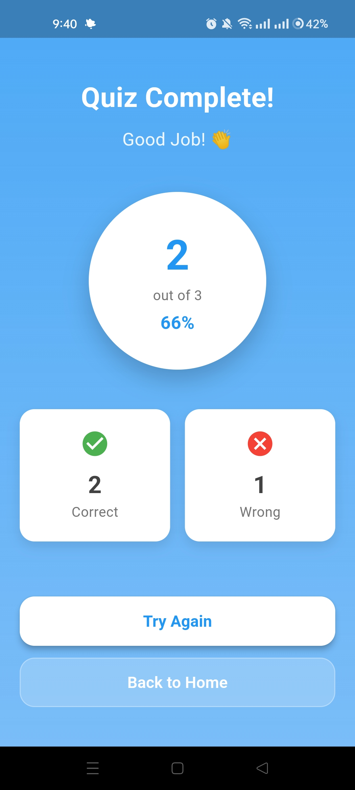
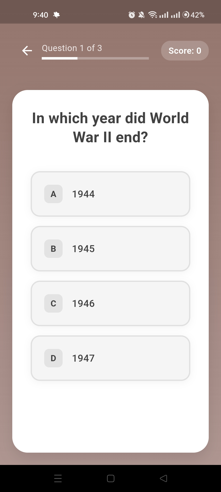
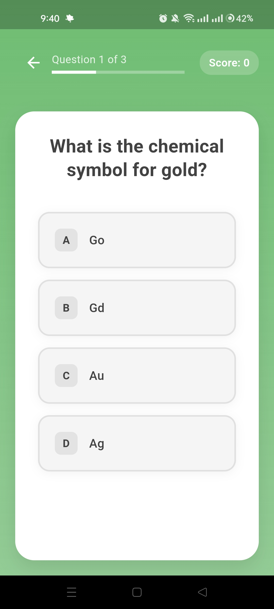
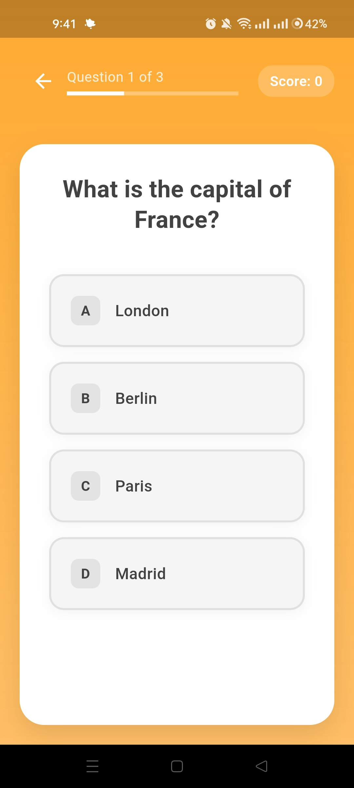

# 🧠 Flutter Quiz App

[](https://flutter.dev)
[](https://dart.dev)
[]()
[](https://opensource.org/)

## 📘 Overview

**Flutter Quiz App** is a beginner-friendly mobile application built using **Flutter** and **Dart**, designed to make learning fun and interactive. It features multiple quiz categories including **General**, **Science**, **Sports**, and **History**, allowing users to test and enhance their knowledge across diverse topics.

This project serves as an excellent practice resource for Flutter beginners, helping them learn about state management, navigation, and UI/UX design while building an engaging quiz experience.

---

## 🎬 Intro

<div align="center">
  
  
    
</div>


## 🎯 Features

* 🧩 **Four Quiz Categories** — General, Science, Sports, and History.
* 🧠 **Multiple-Choice Questions** — Interactive and educational quizzes.
* 🎨 **Attractive UI/UX** — Clean and beginner-friendly design.
* 🏁 **Score Tracking** — Displays user performance after completing each quiz.

---

## 📸 Screenshots

<div align="left">
  <table>
    <tr>
      <td></td>
      <td></td>
      <td></td>
      <td></td>
    </tr>
  </table>
</div>

---

## 🎥 Demo Video

Watch the **Neuromorphism Digital Clock** in action on **X (formerly Twitter):**
👉 [Watch the Demo Here](https://x.com/KishanP07684084/status/1949116612566552703)

---


## 🏗️ Tech Stack

| Technology              | Description                                             |
| ----------------------- | ------------------------------------------------------- |
| **Flutter**             | Cross-platform framework for building native interfaces |
| **Dart**                | Programming language used to develop Flutter apps       |
| **Provider / setState** | State management for handling user interactions         |

---

## ⚙️ Installation & Setup

Follow these simple steps to set up and run the project locally:

### 1️⃣ Clone the Repository

```bash
git clone https://github.com/<your-username>/Flutter-Quiz-App.git
cd Flutter-Quiz-App
```

### 2️⃣ Install Dependencies

```bash
flutter pub get
```

### 3️⃣ Run the Application

```bash
flutter run
```

---

## 🧩 Learning Outcomes

By working on this project, beginners can:

* Understand **Flutter widget structure** and **navigation**.
* Learn how to use **state management** effectively.
* Practice **UI design** and **user interaction logic**.
* Build confidence in structuring a small yet complete Flutter project.

---

## 🤝 Contributing

Contributions are welcome! If you'd like to improve the app or add new features:

1. Fork the repository
2. Create a new branch (`git checkout -b feature-name`)
3. Commit your changes (`git commit -m 'Add new feature'`)
4. Push to your branch (`git push origin feature-name`)
5. Open a Pull Request 🚀

---
🧠 Flutter Development Environment Setup

This project is built using Flutter. Below are the essential details and configuration requirements for replicating the development environment.

| Component              | Details                                      |
| ---------------------- | -------------------------------------------- |
| **Flutter Version**    | 3.27.1 (Stable Channel)                      |
| **Framework Revision** | 17025dd882                                   |
| **Engine Revision**    | cb4b5fff73                                   |
| **Dart Version**       | 3.6.0                                        |
| **DevTools Version**   | 2.40.2                                       |
| **Operating System**   | Windows 10 (Version 10.0.26200.6725, 64-bit) |
| **Locale**             | en-US                                        |


💻 Android Studio

* Version: 2023.3
* Java Runtime: OpenJDK 17 (17.0.10+0--11572160)

  
## 🪪 License

This project is licensed under the **MIT License** — see the [LICENSE](LICENSE) file for details.

---

## 💬 Connect

For questions, suggestions, or collaborations:

📧 **[My Email](coolmax17787@gmail.com)**
🐦 **[Follow me on X (Twitter)](https://x.com/KishanP07684084)**
💼 **[LinkedIn](https://www.linkedin.com/in/hom-bdr-pathak-01a3bb210)**

---

> 🌟 *If this project inspired you or helped your Flutter learning journey, give it a star and share it with others!*

